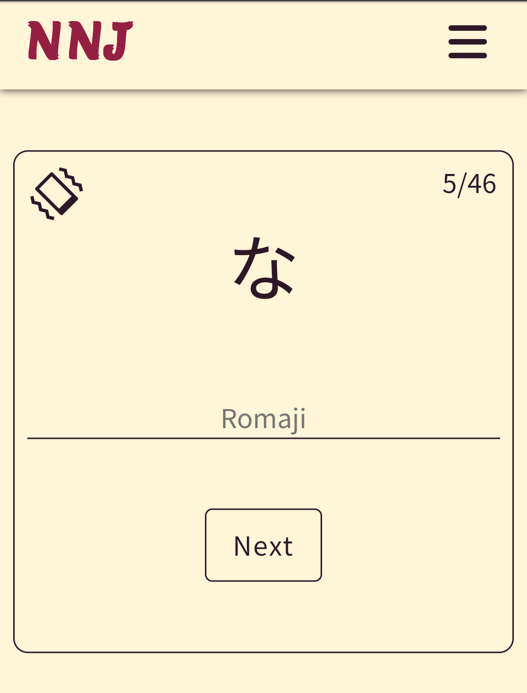

# Nihongo no jikan (Time for Japanese)
> NNJ is a project that contains several useful tools for Japanese learners. Starting from the Japanese alphabets (hiragana and katakana) and finishing with the tool that allows them to listen to texts in Japanese or read them with transcription.

## Table of contents
- [Nihongo no jikan (Time for Japanese)](#nihongo-no-jikan-time-for-japanese)
  - [Table of contents](#table-of-contents)
  - [General info](#general-info)
  - [Screenshots](#screenshots)
  - [Technologies](#technologies)
  - [Setup](#setup)
  - [Status](#status)

## General info
NNJ is a connection of two passions: programming and Japanese studying. It started with the idea of creating an online dictionary of kanji characters based on outside data but then other tools were added. NNJ's navigation links are sorted accordingly to a difficulty level of knowledge that can be got with the help of a particular tool.

Users can start from learning the alphabets. And then check themselves with a quiz of one of the alphabets or both of them in one session.

The next step is the Romaji converter. This tool is for those whose alphabets' knowledge isn't enough to write words by themselves. Romaji converter converts text written in romaji system to the Japanese alphabets. Kanji are still not included at this step.

The third tool is a kanji dictionary called Kanji search. Here users can search kanji characters by their English meaning or with a particular kanji character. For every found kanji users get basic information like how it can be read (one kanji can have several readings), how it should be written etc. Users can also get examples of usage of the kanji.

The last step is Reading assistant. Its main goal is to help users to exercise their ability to read in Japanese. Text provided by a user gots transcription that is added above the main characters. Transcription called furigana normally is used for complicated kanji characters or in books for people studying Japanese. Here it is added for all kanji and katakana characters. Transcription for katakana can be switched off if a user doesn't need it.

## Screenshots

## Technologies
* React.js
* React Router
* JavaScript
* SCSS
* HTML
* Webpack 4
* Axios
* RWD
* [kuroshiro](https://github.com/hexenq/kuroshiro)
* [kuroshiro-analyzer-kuromoji](https://github.com/hexenq/kuroshiro-analyzer-kuromoji)
* [WanaKana](https://github.com/WaniKani/WanaKana)
* [Kanji Alive](https://app.kanjialive.com/api/docs)
* [ResponsiveVoice](https://responsivevoice.org)

## Setup
**npm run dev** - start dev server with hot mode

**npm run build** - compile code for production

**npm run deploy** - push compiled code to gh-pages branch

## Status
Project is _in progress_.

At this moment speech to text conversion in the Reading assistant isn't available and access to kanji search is only available for those who would register and get API key. That's why I plan to create a server for this app. The creation of a server will also allow for adding more tools like a personal kanji dictionary or flashcards with Japanese words or kanji characters.